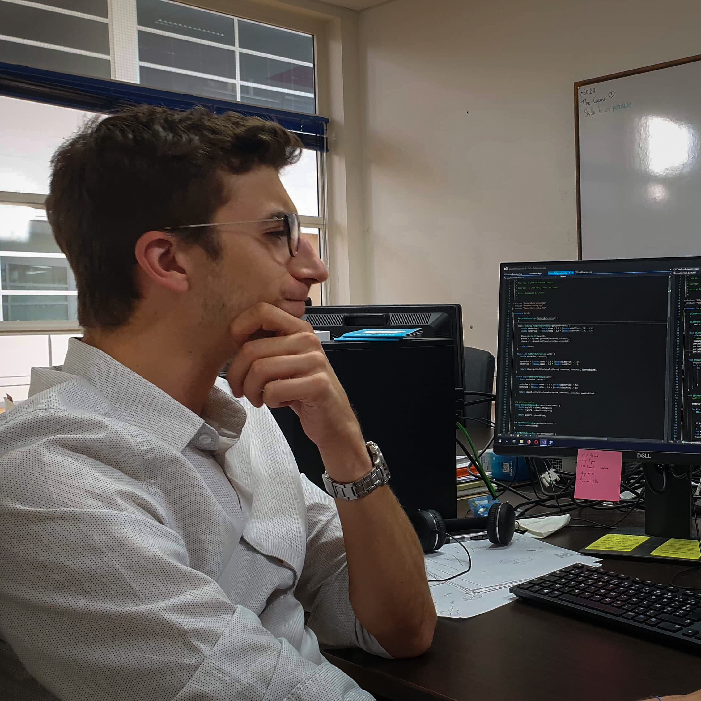

Graduated from the engineer school ENSMM, I started my Ph.D. in the Micro and Nanorobotics team in the departement AS2M at Femto-St in October 2018.

My Ph.D. focues on microrobotics and on the creation of an original vision-based metrologic tool to control positions with a nanometric accuracy by using phase-based patterns.

Computer-vision is a powerful tool to study nanometric displacements since it is contacltess. However most of computer-vision positioning methods relie on pixelic measure and are therefore limited by resolution of the camera, lens choice etc.

With this original method based on periodic patterns (first developped by Dr. Sunkalo, Dr. Laurent and Dr. Sandoz), subpixelic positioning can be achieve by studying the phase of the pattern. This method allows to position with nanometric resolution in translation an micro radian resolution in rotation pattern in the (x, y, theta) plane.

The goal of my Ph.D. is to develop this tool in a more mature way in order to diffuse it (since this tool is already used by 5 researchers and is growing in use). My goal is also to extend the measure to 6DOF with holographic microscopy.

This work is supported by my thesis directors, Guillaume Laurent, Patrick Sandoz and Maxime Jacquot who give me necessary help to achieve presented goals of the thesis.

<dd>  </dd>