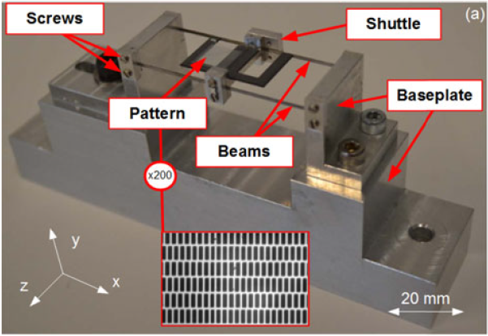
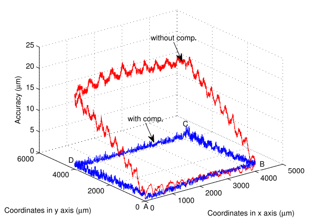
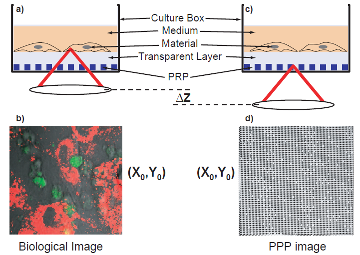
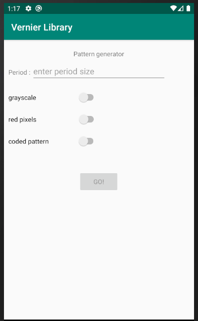
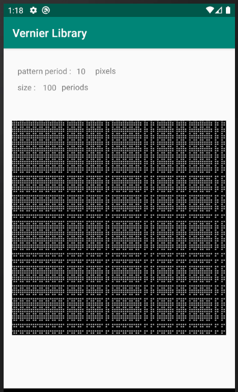

<b>Open source 1D phase measurement on Matlab</b>

Open source code for single dimensionnal patterns phase measurement (and period estimation) is available on github.

<a href="https://github.com/AntoineAndre/1D_phase_measurement">https://github.com/AntoineAndre/1D_phase_measurement</a>

<b>Applications of the nanopositioning tool in research</b>

<dl>
    <dt> Force sensor</dt>
    <dd> Force sensors are often required in order to work at the microscale, but existing ones rarely meet all expectations, particularly in terms of resolution, range, accuracy, or integration potential. This paper presents a novel microforce measurement method by vision, based on a twin-scale pattern fixed on a compliant structure.</dd>
    <dd>  </dd>
    <dd> <cite> V. Guelpa, G. J. Laurent, P. Sandoz, and C. Clévy, “Vision-Based Microforce Measurement with a Large Range-to-Resolution Ratio using a Twin-Scale Pattern,” IEEE/ASME Transactions on Mechatronics, vol. 20, no. 6, pp. 3148–3156, 2015. </cite></dd>
    <dt> Actuator metrology and calibration </dt>
    <dd> High positioning accuracy with micropositioning robots (MPRs) is required to successfully perform many complex tasks, such as microassembly, manipulation, and characterization of biological tissues and minimally invasive inspection and surgery. Despite the widespread use of high-resolution micro and nanopositioning robots, there is very little knowledge about the real positioning accuracy that can be obtained and what the main influential factors are.</dd>
    <dd>  </dd>
    <dd><cite> N. Tan, C. Clévy, G. J. Laurent, P. Sandoz, and N. Chaillet, “Accuracy Quantification and Improvement of Serial Micropositioning Robots for In-Plane Motions,” IEEE Transactions on robotics, vol. 31, no. 6, pp. 1497–1507, Dec. 2015.</cite> </dd>
    <dt> Microrobot characterisation </dt>
    <dd> In many cases, soft and continuum robots represent an interesting alternative to articulated robots because they have the advantage of miniaturization capability, safer interactions with humans and often simpler fabrication and integration. However, it is usually considered that these benefits arise at the expense of accuracy and precision because of the soft or flexible limbs. </dd>
    <dt> Biological study </dt>
    <dd> Position-referenced microscopy (PRM) is based on smart sample holders that integrate a position reference pattern (PRP) in their depth, allowing the determination of the lateral coordinates with respect to the sample-holder itself. Regions of interest can thus be retrieved easily after culture dish transfers from a cell incubator to the microscope stage. </dd>
    <dd>  </dd>
    <dd> <cite> J. Galeano Zea, P. Sandoz, E. Gaiffe, S. Launay, L. Robert, M. Jacquot, F. Hirchaud, J-L. Pretet, C. Mougin, "Position-referenced microscopy for live cell culture monitoring.", Biomedical optics express, 2011.</cite> </dd>
</dl>

<b>Development of a tool to generate different types of periodic patterns.</b>

Application is available as a <b> .apk </b> file downloadable <A HREF="https://cloud.femto-st.fr/nextcloud/index.php/s/3ktPEaos6eeBfTd">here</A>.
<table>
  <tr>
    <td> </td>
    <td> </td>
  </tr>
</table>