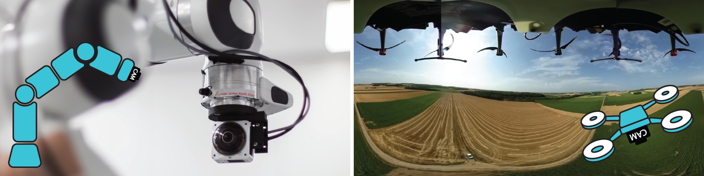

## Research interests

- Computer vision for robotics

- Visual Servoing
- Omnidirectional cameras
- High resolution pose estimation

## Supervision

- Thomas Duvinage (engineer's degree, UTBM, autumn 2023), encapsulate spherical Visual Servoing in a multi-objective control framework
- Matthieu Quaccia (engineer's degree, INSA Toulouse, spring 2023, co-supervision), implementation of feature maps for Direct Visual Servoing
- Quentin Milot (engineer's degree, INSA Rennes, spring 2022, co-supervision), Adaptation for omnidirectional cameras of a SLAM (Simultaneous Localization and Mapping) algorithm
- Valériia Leush (engineer's degree, ENSMM, spring 2021), Software development of a python tool, based on the Vernier library, to generate and measure periodic pattern poses

## Projects participation

- DVS-Straight (AIST-ITH funding, 2021-2024), Direct Visual Servoing with optimal robot trajectories
- Holonet (ISITE BFC funding, 2020-2023), Toward extended visual control capabilities using digital holography
- Nano6D (regional funding, 2018-2021), 3D metrology at nanoscale
